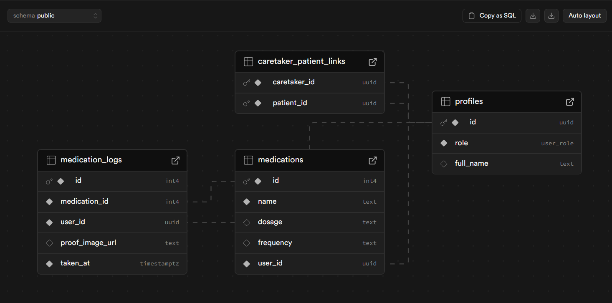

# MediCare Companion 💊

Welcome to MediCare Companion, a modern, full-stack web application designed to help patients and their caretakers manage medication schedules with ease and accuracy. This project was built as a skills assessment for the React Developer position at GravityWrite.

**Live Demo:** [https://meds-buddy-check-frontend.vercel.app/](https://meds-buddy-check-frontend.vercel.app/)

**Frontend Repo:** [https://github.com/pritam16raha/meds-buddy-check-frontend.git](https://github.com/pritam16raha/meds-buddy-check-frontend.git)

**Backend:** [https://github.com/pritam16raha/meds_buddy_check_backend.git](https://github.com/pritam16raha/meds_buddy_check_backend.git)

---

### 🏛️ Project Structure

This project is organized into two separate repositories to maintain a clean separation of concerns between the frontend application and the backend database schema definition.

* **Frontend (This Repository):** `meds-buddy-check-frontend`
    * Contains the complete React + Vite application that users interact with.
    * This is the **main project** that needs to be run.

* **Backend (Schema Reference):** `meds-buddy-check-backend`
    * Contains the Drizzle ORM schemas used to define the database structure.
    * **You do not need to clone or run this repository.** It is provided for reference only, as Supabase handles the live backend services.

---

### ✨ Key Features

This application is built with a robust set of features that go beyond the basic requirements, demonstrating a full range of development skills.

#### Core Functionality
* **Secure User Authentication:** Complete sign-up, sign-in, and sign-out flows powered by Supabase Auth, including email verification.
* **Dynamic Medication Tracking:** Select any date on the calendar to view a dynamic list of "Taken" and "Pending" medications for that specific day.
* **Full Medication CRUD:** Logged-in patients can easily **C**reate, **R**ead, **U**pdate, and **D**elete their medications.
* **Adherence Dashboard:** The dashboard provides real-time statistics on medication adherence, including day streaks and monthly rates.

#### Bonus & Advanced Features
* **📸 Photo Proof Uploads:** Patients can upload a photo as proof of taking their medication, which is securely stored using Supabase Storage and can be viewed in a modal.
* **⚡ Optimistic UI Updates:** Marking a medication as "taken" updates the UI instantly for a snappy, responsive user experience.
* **🧪 Comprehensive Testing:** The application includes both unit and component tests written with Vitest.

---

### 🛠️ Tech Stack

* **Frontend:** React, TypeScript, Vite, Tailwind CSS
* **UI Components:** shadcn/ui
* **Backend & Database:** Supabase (Auth, PostgreSQL, Storage)
* **Data Fetching:** TanStack Query (React Query)
* **Schema (Reference):** Drizzle ORM
* **Form Handling:** React Hook Form with Zod
* **Testing:** Vitest & React Testing Library

---

### 🗃️ Database Schema

The application's data is structured using four related tables in a PostgreSQL database, managed by Supabase.



---

### 🚀 Getting Started

To run this project, you only need to set up the frontend application.

#### Prerequisites

* Node.js (v18 or later)
* A free Supabase account to create your own database.

#### Setup Instructions

1.  **Clone the Frontend Repository**
    ```bash
    git clone https://github.com/pritam16raha/meds-buddy-check-frontend.git
    cd meds-buddy-check-frontend
    ```

2.  **Install Dependencies**
    ```bash
    npm install
    ```

3.  **Set Up Environment Variables**
    This is the most important step. The application needs to connect to a Supabase project for the backend.

    a. Create a new file named `.env` in the root of the project.

    b. Copy the contents of the `.env.example` file and paste them into your new `.env` file. It should look like this:
    ```env
    VITE_SUPABASE_URL="YOUR_SUPABASE_PROJECT_URL"
    VITE_SUPABASE_ANON_KEY="YOUR_SUPABASE_ANON_KEY"
    ```
    c. **You will need to create your own free Supabase project** to get these keys. In your Supabase project's dashboard, go to **Project Settings > API** to find your **URL** and **`anon` public key**.

    d. **Important:** The database tables will be empty. To test the application fully, you will need to use the provided Drizzle schemas from the [backend reference repository](https://github.com/pritam16raha/meds_buddy_check_backend.git) to set up your tables. *(This note guides them on how to get the schema if they want to recreate it)*.

4.  **Run the Application**
    You are all set! Run the following command to start the development server.
    ```bash
    npm run dev
    ```
    The application will be available at `http://localhost:5173`.

---

### 🔬 Running Tests

To run the suite of tests, use the following command:

```bash
npm test